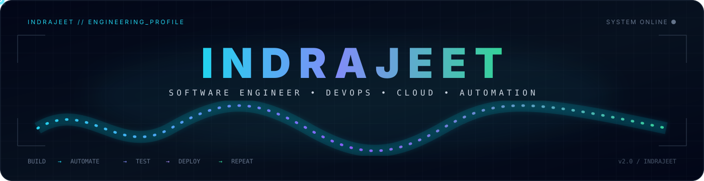

<div align="center">



<br><br>


<br><br>

<a href="https://indrajeet-portfolio-jawi.vercel.app/">

</a>
 
<a href="https://www.linkedin.com/in/indrajeet-khatarkar-919980275/">

</a>
 
<a href="mailto:[indrajeetkhatarkar5@gmail.com](mailto:indrajeetkhatarkar5@gmail.com)">

</a>

<br><br>


</div>

---

<div align="center">

```text
╔══════════════════════════════════════════════════════════════╗
║                 INDRAJEET // SYSTEM PROFILE                 ║
╠══════════════════════════════════════════════════════════════╣
║                                                              ║
║   ROLE       → Software Engineer                             ║
║   FOCUS      → Java • DevOps • Cloud • Automation            ║
║   LOCATION   → India 🇮🇳                                     ║
║                                                              ║
║   STATUS     → BUILDING • LEARNING • AUTOMATING              ║
║                                                              ║
║   MISSION    → CODE → TEST → AUTOMATE → DEPLOY              ║
║                                                              ║
╚══════════════════════════════════════════════════════════════╝
```

</div>

## `01 // ABOUT ME`

Hi, I'm **Indrajeet Khatarkar** — a Software Engineer focused on **Java, Backend Development, DevOps, Cloud and Automation Testing**.

I enjoy understanding the complete software lifecycle — from writing code and building applications to testing, automation, CI/CD and deployment.

```text
I DON'T JUST WANT TO WRITE CODE.

I WANT TO UNDERSTAND
HOW THE CODE IS BUILT,
TESTED,
AUTOMATED,
DEPLOYED
AND IMPROVED.
```

### CURRENT FOCUS

`☕ Java & Spring Boot`
`⚙️ Backend & REST APIs`
`☁️ AWS & Cloud`
`🐳 Docker`
`🔄 Jenkins & CI/CD`
`🏗️ Terraform`
`🧪 Selenium • Playwright • TestNG`
`🗄️ SQL • MongoDB`
`🧠 DSA & Problem Solving`

---

## `02 // ENGINEERING STACK`

<div align="center">

### PROGRAMMING


<br><br>

### DEVELOPMENT


<br><br>

### DEVOPS & CLOUD


<br><br>

### DATABASE & TESTING


</div>

---

## `03 // ENGINEERING PIPELINE`

<div align="center">

```text
                  ┌──────────────┐
                  │     IDEA     │
                  └──────┬───────┘
                         ↓
                  ┌──────────────┐
                  │     CODE     │
                  └──────┬───────┘
                         ↓
                  ┌──────────────┐
                  │     GIT      │
                  └──────┬───────┘
                         ↓
                  ┌──────────────┐
                  │   JENKINS   │
                  └──────┬───────┘
                         ↓
                  ┌──────────────┐
                  │    BUILD     │
                  └──────┬───────┘
                         ↓
                  ┌──────────────┐
                  │     TEST     │
                  └──────┬───────┘
                         ↓
                  ┌──────────────┐
                  │    DOCKER    │
                  └──────┬───────┘
                         ↓
                  ┌──────────────┐
                  │     AWS      │
                  └──────┬───────┘
                         ↓
                  ┌──────────────┐
                  │    DEPLOY    │
                  └──────────────┘
```

</div>

---

## `04 // AUTOMATION MINDSET`

<div align="center">

```text
IF IT REPEATS      → AUTOMATE IT

IF IT CAN BREAK    → TEST IT

IF IT FAILS        → DEBUG IT

IF IT WORKS        → IMPROVE IT

IF IT SCALES       → ENGINEER IT
```

</div>

**Testing Toolkit**

`Selenium` · `Playwright` · `TestNG` · `Maven` · `Page Object Model` · `Postman` · `API Testing` · `STLC`

---

## `05 // SELECTED PROJECTS`

<table>
<tr>
<td width="50%">

### 🏥 Pet Clinic Management

**Java • Spring Boot • Thymeleaf • Database**

Spring-based web application focused on backend development and database integration.

<a href="https://github.com/indrajeetkhatarkar/petclinic-management-system">VIEW PROJECT →</a>

</td>

<td width="50%">

### 🧪 actiTIME Automation

**Java • Selenium • TestNG • Maven**

Automation testing project using Selenium WebDriver and Page Object Model.

<a href="https://github.com/indrajeetkhatarkar/actiTIME-Web-Application-Testing">VIEW PROJECT →</a>

</td>
</tr>

<tr>
<td width="50%">

### 🤖 AI Agent

**MERN • Google Gemini • AI**

AI-powered chatbot application built with MERN and Gemini integration.

<a href="https://github.com/indrajeetkhatarkar/AI-Agent">VIEW PROJECT →</a>

</td>

<td width="50%">

### 🛒 Grocery Store

**Python • Flask • MySQL • JavaScript**

Full-stack grocery shopping application with browsing and ordering.

<a href="https://github.com/indrajeetkhatarkar/Grocery-Store">VIEW PROJECT →</a>

</td>
</tr>

<tr>
<td width="50%">

### 📚 Book Store

**React • Node.js • Express • MongoDB**

MERN application with authentication, books, favourites and cart functionality.

<a href="https://github.com/indrajeetkhatarkar/Book-Store-Management">VIEW PROJECT →</a>

</td>

<td width="50%">

### 🌐 Developer Portfolio

**TypeScript • React • Modern Web**

My personal developer portfolio and professional digital identity.

<a href="https://indrajeet-portfolio-jawi.vercel.app/">VISIT PORTFOLIO →</a>

</td>
</tr>
</table>

---

## `06 // GITHUB TELEMETRY`

<div align="center">


<br><br>


</div>

---

## `07 // CONTRIBUTION ACTIVITY`

<div align="center">


</div>

---

## `08 // CURRENT MISSION`

| STATUS | MISSION                             |
| :----: | :---------------------------------- |
|   🟢   | Strengthen Java & Spring Boot       |
|   🟢   | Build production-ready applications |
|   🟢   | Improve DSA & problem solving       |
|   🟢   | Deepen AWS & Cloud knowledge        |
|   🟢   | Build CI/CD pipelines               |
|   🟢   | Improve Docker & Terraform          |
|   🟢   | Master Automation Testing           |
|   🔵   | Explore AI-powered applications     |

---

## `09 // CONNECT`

<div align="center">

<a href="https://indrajeet-portfolio-jawi.vercel.app/">

</a>

<a href="https://www.linkedin.com/in/indrajeet-khatarkar-919980275/">

</a>

<a href="mailto:[indrajeetkhatarkar5@gmail.com](mailto:indrajeetkhatarkar5@gmail.com)">

</a>

<br><br>

<a href="https://leetcode.com/u/2TNfbS3Mfm/">

</a>

<a href="https://www.geeksforgeeks.org/user/indrajeetk1r12/">

</a>

<a href="https://www.codechef.com/users/indrajeet_04">

</a>

</div>

---

<div align="center">

```text
╔══════════════════════════════════════════════════════════════╗
║                                                              ║
║        BUILD • AUTOMATE • TEST • DEPLOY • REPEAT             ║
║                                                              ║
║                 SYSTEM STATUS : LEARNING                     ║
║                 NEXT RELEASE   : BETTER                      ║
║                                                              ║
╚══════════════════════════════════════════════════════════════╝
```

**Thanks for visiting my profile. ⭐**

</div>
