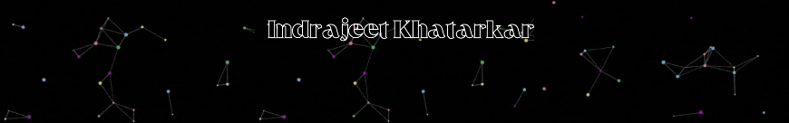

<!-- ========================================================= -->

<!--                    PROFILE HEADER                         -->

<!-- ========================================================= -->

<h1>Hi, I'm Indrajeet Khatarkar 👋</h1>

<h3>Software Engineer • DevOps & Cloud Enthusiast • Automation Tester</h3>

Building software, automating workflows, and continuously learning modern cloud technologies.

---

## 👨‍💻 About Me

I'm **Indrajeet Khatarkar**, a Software Engineer and technology enthusiast focused on building reliable applications, automating testing and deployment workflows, and exploring cloud-native technologies.

* 💻 Strong interest in **Java, Spring Boot & Software Development**
* ☁️ Exploring **AWS Cloud & DevOps**
* 🔄 Working with **CI/CD, Jenkins, Docker & Terraform**
* 🧪 Interested in **Automation Testing using Selenium & Playwright**
* 🐧 Comfortable with **Linux, Git & GitHub**
* 🗄️ Working with **SQL & relational databases**
* 🚀 Continuously improving my **DSA, development and DevOps skills**
* 🎯 Goal: Build scalable, reliable and production-ready solutions

---

## 🛠️ Tech Stack

### 👨‍💻 Programming & Development

`Java` `JavaScript` `SQL` `HTML` `CSS`

### 🌱 Backend & Frameworks

`Spring Boot` `Spring MVC` `REST APIs` `Node.js` `Express.js`

### 🧪 Testing & Automation

`Selenium` `Playwright` `TestNG` `Maven` `Page Object Model` `Postman`

### ☁️ DevOps & Cloud

`AWS` `Docker` `Jenkins` `Terraform` `Linux` `Git` `GitHub` `CI/CD`

### 🗄️ Databases

`MySQL` `MongoDB`

---

## 🚀 Featured Projects

### 🏥 Pet Clinic Management System

A web-based application built using **Java, Spring Boot, Thymeleaf and database integration**.

**Focus:** Backend Development • Spring Boot • Database Integration

→ [View Project](../petclinic-management-system)

---

### 🧪 actiTIME Web Application Testing

Automation testing project using **Java, Selenium WebDriver, TestNG, Maven and Page Object Model**.

**Focus:** Test Automation • Selenium • TestNG • Maven • POM

→ [View Project](../actiTIME-Web-Application-Testing)

---

### 🤖 AI Agent

AI-powered chatbot application built using the **MERN stack** with **Google Gemini integration**.

**Focus:** AI • MERN Stack • API Integration • Full Stack Development

→ [View Project](../AI-Agent)

---

### 🛒 Grocery Store

Full-stack web application for online grocery shopping with product browsing and ordering functionality.

**Focus:** Python • Flask • MySQL • JavaScript • Bootstrap

→ [View Project](../Grocery-Store)

---

### 📚 Book Store Management

MERN-based book store application featuring user authentication, books, favourites and cart functionality.

**Focus:** React • Node.js • Express.js • MongoDB

→ [View Project](../Book-Store-Management)

---

### 🌐 Portfolio

My personal developer portfolio showcasing my projects, technical skills and experience.

→ [Visit Portfolio](../indrajeet-portfolio)

---

## 📊 GitHub Activity

---

## 🔥 Contribution Streak

---

## 🐍 Contribution Graph

---

## 🌐 Connect With Me

**LinkedIn:** `indrajeet-khatarkar-919980275`
**Email:** `indrajeetkhatarkar5@gmail.com`
**LeetCode:** `2TNfbS3Mfm`
**GeeksforGeeks:** `indrajeetk1r12`
**CodeChef:** `indrajeet_04`
**Portfolio:** `indrajeet-portfolio-jawi`

---

### 💡 "Programming isn't about what you know. It's about what you can figure out."

 

**Thanks for visiting my profile! ⭐**

