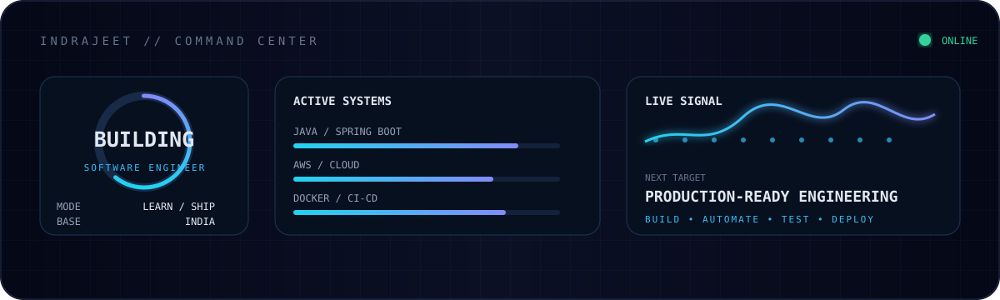
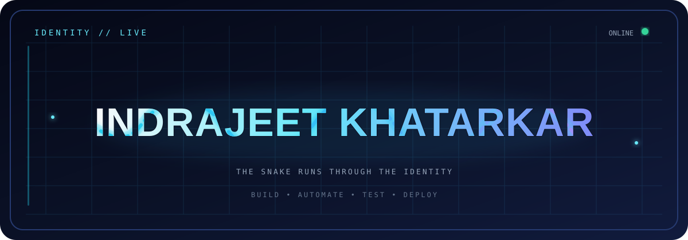
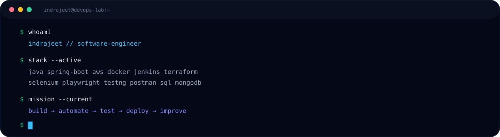
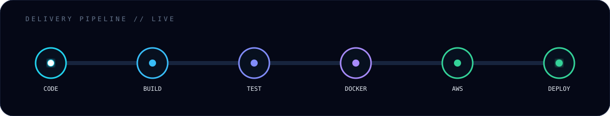
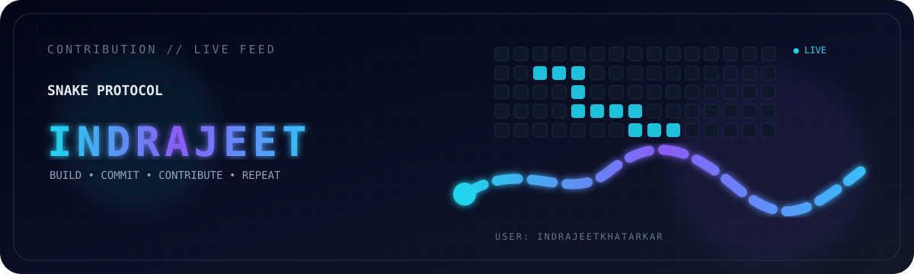
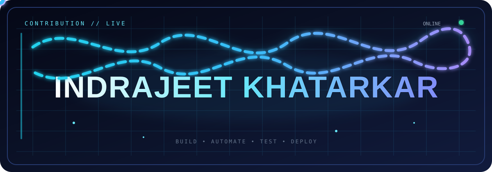

<!-- ═════════════════════ HERO ═════════════════════ -->

  

  

&nbsp;&nbsp;&nbsp;

&nbsp;&nbsp;&nbsp;

  

 

<!-- ═════════════════════ COMMAND CENTER ═════════════════════ -->

 

<!-- ═════════════════════ SNAKE IDENTITY ═════════════════════ -->

 

# ⚡ ENGINEER • AUTOMATE • SHIP

### Java Developer · DevOps Enthusiast · Cloud & Automation

I’m <b>Indrajeet Khatarkar</b>, a Software Engineer from India building
reliable applications and exploring the complete journey from
<b>code → testing → automation → deployment.</b>

I enjoy backend engineering, cloud infrastructure, CI/CD,
automation testing and continuously improving the way software is built.

 

<!-- ═════════════════════ CORE DOMAINS ═════════════════════ -->

<table>
<tr>

<td align="center" width="25%">

<h2>☕</h2>

<b>JAVA</b>

  

Spring Boot 
Backend Engineering 
REST APIs 
Maven

</td>

<td align="center" width="25%">

<h2>☁️</h2>

<b>CLOUD</b>

  

AWS 
Cloud Infrastructure 
Deployment 
Linux

</td>

<td align="center" width="25%">

<h2>⚙️</h2>

<b>DEVOPS</b>

  

Docker 
Jenkins 
Terraform 
CI/CD

</td>

<td align="center" width="25%">

<h2>🧪</h2>

<b>AUTOMATION</b>

  

Selenium 
Playwright 
TestNG 
API Testing

</td>

</tr>
</table>

  

<!-- ═════════════════════ TERMINAL ═════════════════════ -->

 

<!-- ═════════════════════ TECHNOLOGY ═════════════════════ -->

<h1>🧬 Technology Arsenal</h1>

Tools I use, explore and build with.

 

<h3>PROGRAMMING & DEVELOPMENT</h3>

  

<h3>DEVOPS & CLOUD</h3>

  

<h3>DATABASE & API</h3>

  

<h3>AUTOMATION & QUALITY</h3>

<b>Selenium</b> ·
<b>Playwright</b> ·
<b>TestNG</b> ·
<b>Maven</b> ·
<b>Page Object Model</b> ·
<b>STLC</b> ·
<b>API Testing</b>

 

<!-- ═════════════════════ DEVOPS PIPELINE ═════════════════════ -->

 

<!-- ═════════════════════ PROJECTS ═════════════════════ -->

# 🚀 Selected Builds

<table>

<tr>

<td width="50%" valign="top">

<h2>🏥 Pet Clinic Management</h2>

<b>Java · Spring Boot · Thymeleaf · Database</b>

Spring-based application focused on backend engineering,
application architecture and database integration.

<a href="https://github.com/indrajeetkhatarkar/petclinic-management-system">
<b>VIEW PROJECT →</b>
</a>

</td>

<td width="50%" valign="top">

<h2>🧪 actiTIME Automation</h2>

<b>Java · Selenium · TestNG · Maven</b>

Browser automation project using Selenium WebDriver,
Page Object Model and maintainable test architecture.

<a href="https://github.com/indrajeetkhatarkar/actiTIME-Web-Application-Testing">
<b>VIEW PROJECT →</b>
</a>

</td>

</tr>

<tr>

<td width="50%" valign="top">

<h2>🤖 AI Agent</h2>

<b>MERN · Google Gemini · AI</b>

AI-powered chatbot application combining MERN development
with Google Gemini integration.

<a href="https://github.com/indrajeetkhatarkar/AI-Agent">
<b>VIEW PROJECT →</b>
</a>

</td>

<td width="50%" valign="top">

<h2>🛒 Grocery Store</h2>

<b>Python · Flask · MySQL · JavaScript</b>

Full-stack grocery application with product browsing
and shopping functionality.

<a href="https://github.com/indrajeetkhatarkar/Grocery-Store">
<b>VIEW PROJECT →</b>
</a>

</td>

</tr>

<tr>

<td width="50%" valign="top">

<h2>📚 Book Store</h2>

<b>React · Node.js · Express · MongoDB</b>

MERN application featuring authentication, books,
favourites and cart functionality.

<a href="https://github.com/indrajeetkhatarkar/Book-Store-Management">
<b>VIEW PROJECT →</b>
</a>

</td>

<td width="50%" valign="top">

<h2>🌐 Developer Portfolio</h2>

<b>TypeScript · React · Modern Web</b>

My personal developer portfolio showcasing projects,
skills and professional identity.

<a href="https://indrajeet-portfolio-jawi.vercel.app/">
<b>OPEN PORTFOLIO →</b>
</a>

</td>

</tr>

</table>

  

<!-- ═════════════════════ GITHUB ACTIVITY ═════════════════════ -->

# 📊 GitHub Activity

 

 

<!-- ═════════════════════ CUSTOM SNAKE ART ═════════════════════ -->

 

<!-- ═════════════════════ CURRENT MISSION ═════════════════════ -->

# 🎯 Current Mission

<table>

<tr>

<td align="center">

🟢 
<b>Java + Spring Boot</b> 
Backend Engineering

</td>

<td align="center">

🟢 
<b>AWS + Cloud</b> 
Cloud Infrastructure

</td>

<td align="center">

🟢 
<b>Docker + Jenkins</b> 
CI/CD Automation

</td>

<td align="center">

🟢 
<b>Terraform</b> 
Infrastructure as Code

</td>

</tr>

<tr>

<td align="center">

🟢 
<b>Automation</b> 
Selenium + Playwright

</td>

<td align="center">

🟢 
<b>DSA</b> 
Problem Solving

</td>

<td align="center">

🔵 
<b>AI Applications</b> 
Intelligent Systems

</td>

<td align="center">

🔵 
<b>Engineering</b> 
Build • Ship • Improve

</td>

</tr>

</table>

  

<!-- ═════════════════════ PHILOSOPHY ═════════════════════ -->

<h1>⚡ Engineering Philosophy</h1>

<h3>
BUILD → TEST → AUTOMATE → DEPLOY → OBSERVE → IMPROVE
</h3>

<b>Write it.</b>
&nbsp;&nbsp;•&nbsp;&nbsp;
<b>Test it.</b>
&nbsp;&nbsp;•&nbsp;&nbsp;
<b>Automate it.</b>
&nbsp;&nbsp;•&nbsp;&nbsp;
<b>Ship it.</b>
&nbsp;&nbsp;•&nbsp;&nbsp;
<b>Make it better.</b>

 

<!-- ═════════════════════ CONNECT ═════════════════════ -->

# 🌐 Let's Connect

 

  

 

<!-- ═════════════════════ FINAL SNAKE MOTION ═════════════════════ -->

<!-- ═════════════════════ FINAL SNAKE MOTION ═════════════════════ -->

  

<!-- ═════════════════════ PREMIUM ENDING ═════════════════════ -->

 

  

<b>Thanks for stopping by. ⭐</b>

